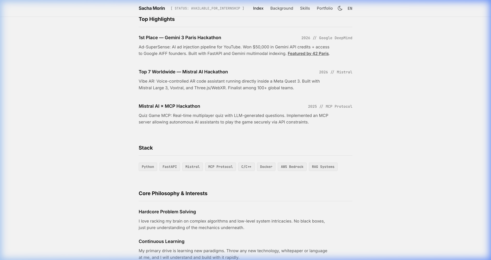
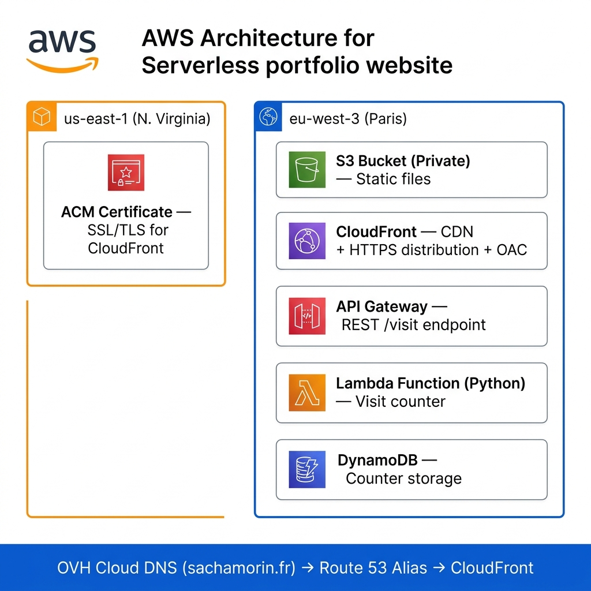
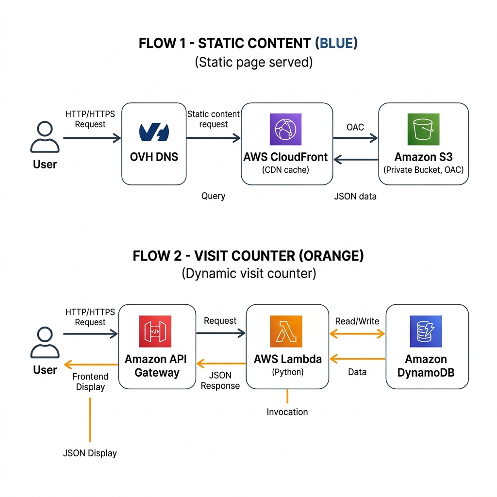

# Portfolio AWS — sachamorin.fr

> **Live:** [https://sachamorin.fr](https://sachamorin.fr)



A production-grade, fully serverless portfolio deployed on AWS — built from scratch and automated with Terraform IaC. Custom domain via OVH Cloud, HTTPS enforced via ACM + CloudFront.

---

## 🧠 Why this project

I built this portfolio to turn AWS theory into a real, end-to-end cloud project I fully own and understand. Rather than using a hosted service, I wanted to provision every resource myself — from DNS to Lambda — and automate the entire deployment with Infrastructure as Code.

---

## ⚙️ Tech Stack

| Layer | Technology |
|---|---|
| IaC | Terraform 1.10+ (S3 backend + native locking) |
| Frontend | HTML · CSS · Vanilla JS · i18n (EN/FR) |
| Hosting | AWS S3 (private, no public access) |
| CDN + HTTPS | AWS CloudFront + ACM (us-east-1) |
| Visit counter | AWS Lambda (Python) + API Gateway + DynamoDB |
| DNS | OVH Cloud → Route 53 (apex + www Alias) |
| FinOps | AWS Budgets (alert at $5/month) |
| Security | IAM least-privilege · OAC (Origin Access Control) · HTTPS enforced |

---

## 📂 Project Structure

```
.
├── index.html                  # Main SPA (bilingual EN/FR)
├── i18n.js                     # Translations (English / French)
├── styles.css                  # Design system
├── cv_sacha_morin_ia.html      # CV page (A4, print-ready)
├── CV_Sacha_Morin.pdf          # Generated PDF (headless Chrome)
├── config.js                   # Runtime config (API endpoint)
├── deploy.sh                   # One-command deploy (S3 sync + CF invalidation)
└── infra/
    ├── backend.tf               # Remote state (S3 + native locking)
    ├── main.tf                  # Root module
    ├── variables.tf
    ├── outputs.tf
    ├── providers.tf
    ├── versions.tf
    ├── budget.tf                # AWS Budgets FinOps alert
    ├── environments/
    │   └── prod.tfvars
    ├── lambda/
    │   └── visit/
    │       ├── handler.py       # Visit counter (Python)
    │       └── build.sh
    └── modules/
        ├── bootstrap-backend/   # S3 state bucket
        ├── static-site/         # S3 + CloudFront + ACM + Route 53
        ├── visit-api/           # Lambda + API Gateway + DynamoDB
        └── dns/                 # OVH → Route 53 delegation
```

---

## 🏗️ Architecture



CloudFront securely delivers the website from a **private S3 bucket** using **OAC (Origin Access Control)**. The ACM certificate is provisioned in `us-east-1` to meet CloudFront's regional requirement.

---

## 🔄 Request Flow



- **Static content** → OVH DNS resolves to CloudFront → CloudFront fetches from private S3 via OAC
- **Visit counter** → API Gateway → Lambda (Python) → DynamoDB → JSON response displayed on frontend

---

## 🔄 Deployment

```bash
# One-command deploy: syncs to S3 + invalidates CloudFront cache
./deploy.sh
```

Under the hood:
```bash
aws s3 sync . s3://$BUCKET --delete --exclude "infra/*"
aws cloudfront create-invalidation --distribution-id $CF_ID --paths "/*"
```

---

## 🏠 Terraform Modules

| Module | Resources |
|---|---|
| `bootstrap-backend` | S3 state bucket (versioned, AES256) |
| `static-site` | S3 (private) + CloudFront (OAC) + ACM + Route 53 |
| `visit-api` | Lambda + API Gateway + DynamoDB |
| `dns` | Route 53 zone, apex Alias + www CNAME |

```bash
terraform init
terraform validate
terraform plan -var-file="environments/prod.tfvars"
terraform apply -var-file="environments/prod.tfvars"
```

---

## 🔒 State Management

- Remote state stored in S3 (versioned + AES256 encrypted)
- Native S3 locking (Terraform 1.10+) — no DynamoDB lock table needed
- Naming convention: `sacha-portfolio-prod-tfstate`

---

## 🚀 Features

- **Bilingual SPA** — English / French toggle (no page reload)
- **Dark / Light mode** — persisted in localStorage
- **Visit counter** — real-time serverless counter (Lambda + DynamoDB)
- **CV download** — A4 PDF generated via headless Chrome, hosted on S3
- **FinOps** — AWS Budget alert at $5/month to stay cost-aware

---

## 📸 Live

**[https://sachamorin.fr](https://sachamorin.fr)**

---

*Built by [Sacha Morin](https://linkedin.com/in/sacha-morin60) — 42 Paris · RNCP Level 7 in progress*
